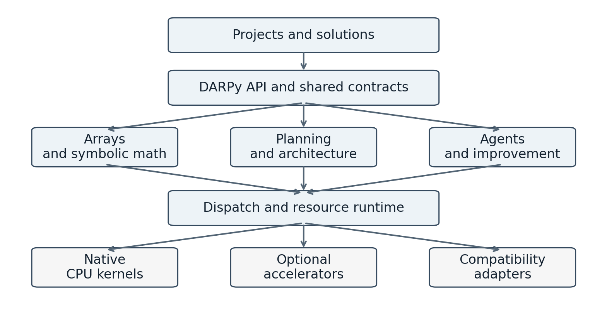
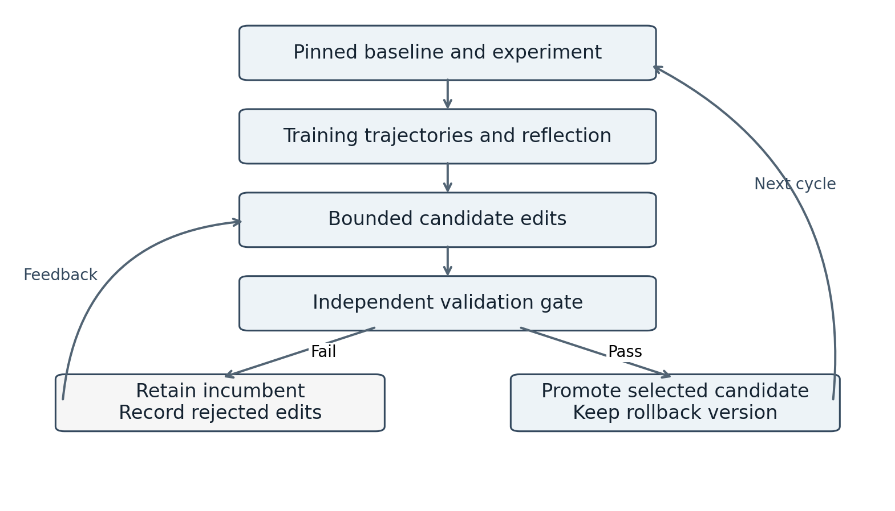

# DARPy Platform Specification

Distributed Architecture Reasoning and Planning

Version 0.2 | 13 September 2026 | Architecture and implementation specification

Prepared for Daryl Yourk and DarbotLabs engineering

## 1 Platform decision

DARPy will be the common Python platform for DarbotLabs. It will provide the computational primitives, schemas, execution services, agents, planning algorithms, and improvement workflows that projects can reuse instead of rebuilding their own foundations. A developer should be able to use one numerical function, embed a software engineering agent, run an agent team, or operate a distributed swarm through the same versioned platform contracts.

The platform will grow through independently installable capability packages under a consistent darpy import namespace. Its public interface will remain stable as implementations move from external adapters to DARPy-maintained native components. Full feature, behavior, and functionality parity with specified NumPy and SymPy releases is a long-term product requirement. Early releases will publish explicit coverage and dependency status rather than claim that a small compatible subset is complete.

Efficiency means measured improvement in useful work per unit of time, memory, energy, and inference cost while preserving the required result. The architecture therefore separates exact computation, approximate ML computation, language-agent behavior, and release evaluation. Improvements to one layer cannot silently weaken another layer's correctness contract.

This specification defines the target platform and the initial implementation program. Section 3 records the inherited baseline; the repository capability registry and implementation status document identify delivered scope. Interfaces and milestones remain proposed requirements unless the implementation status and its test evidence explicitly mark them delivered. Performance budgets are engineering targets, not measured DARPy results.

### 1a Product meanings

| DARPy role | Concrete meaning | Primary interface |
| --- | --- | --- |
| Platform | Shared development and execution foundation | Python SDK and CLI |
| Algorithm family | Partitioning, allocation, planning, search, and optimization | darpy.algorithms |
| Agent | Stateful task execution with tools and verifiable outcomes | darpy.agent |
| SWE agent | Repository analysis, changes, tests, and release preparation | darpy.swe |
| Team | Explicit roles and a shared task plan | darpy.team |
| Swarm | Dynamic assignment across bounded workers | darpy.swarm |
| Architecture | Typed component and dependency graphs with constraints | darpy.architecture |
| Layer | Compatibility and execution boundary for existing projects | darpy.compat and darpy.runtime |
| Schema | Versioned definitions for tasks, tools, data, and evidence | darpy.schema |
| Solution | A deployable composition of capabilities and policies | SolutionManifest |

DAR is the architecture and reasoning concept; DARP includes planning; DARPy is the Python-facing platform and product identity. Distributional methods remain supported within statistics, uncertainty modeling, and ML without changing this expansion.

## 2 Requirements and completion rules

The words MUST, SHOULD, and MAY identify mandatory requirements, preferred defaults, and optional extensions. A release satisfies a requirement only when its acceptance evidence exists for the advertised platform and execution mode. A planned feature remains visible in the capability registry with status planned.

| Identifier | Mandatory outcome | Completion evidence |
| --- | --- | --- |
| DP 001 | All new shared DarbotLabs Python foundations use DARPy contracts | Dependency rules and migration inventory |
| DP 002 | Small use cases load only their required capabilities | Import graph and startup measurements |
| DP 003 | NumPy parity covers the complete pinned public surface | Symbol inventory and behavioral suite |
| DP 004 | SymPy parity covers the complete pinned public surface | Symbol inventory and domain tests |
| DP 005 | Native replacements expose their provenance and dependencies | Runtime dispatch and dependency reports |
| DP 006 | Agents verify task postconditions against artifacts | Action receipts and verifier results |
| DP 007 | Teams and swarms recover from worker failure | Lease and replay fault tests |
| DP 008 | Shared schemas survive versioned migration | Round-trip and mixed-version tests |
| DP 009 | Improvement uses measured selection and rollback | Experiment and promotion records |
| DP 010 | Exact semantics survive optimization | Differential and invariant tests |
| DP 011 | Windows and Linux are supported development platforms | Wheel and integration CI |
| DP 012 | Existing projects migrate incrementally | Per-project compatibility scorecards |
| DP 013 | Learning and execution budgets are enforceable | Resource accounting and stop tests |
| DP 014 | Improvements retain reproducible ancestry | Content-addressed experiment manifests |
| DP 015 | New package families can join without expanding the base import | Capability onboarding conformance |
| DP 016 | Agent Client Protocol and Microsoft Activity Protocol are supported through explicit SDK adapters | Negotiation, session, cancellation, permission, payload, and turn tests |
| DP 017 | The SDK fork becomes the Darbot Python SDK throughout | Package, import, CLI, documentation, example, and wheel audits |

These requirements govern the entire program. Milestones restrict when capabilities are delivered, not whether they remain in the final scope. Unsupported cases MUST produce a typed capability error or an explicitly enabled adapter fallback. They MUST NOT return approximate results disguised as compatible results.

## 3 Existing repository baseline

The baseline is github.com/DarbotLM/darpy at commit 3dc06ee15c117c95eb642eb289b1c142fe078ac7, inspected on 13 September 2026. The repository description is Distributed Architecture Reasoning and Planning. Its implementation derives from oldworship/DARP-python and the alice-st/DARP upstream project. The original DARP work concerns dividing an area among robots and planning coverage paths. [S1]

The existing implementation partitions an obstacle grid, checks region connectivity, builds spanning trees, constructs coverage trajectories, and compares four tree construction modes to reduce turns. Planning executes centrally within Python. Existing code provides a spatial planning seed for the larger platform; its spatial assumptions must be stated whenever adapted to software or knowledge tasks.

| Existing file | Destination | Migration responsibility |
| --- | --- | --- |
| darp.py | darpy.algorithms.coverage.partition | Preserve region allocation behavior and remove process exits |
| kruskal.py and Edges.py | darpy.graph and darpy.algorithms.graph | Reusable graphs and spanning trees |
| CalculateTrajectories.py | darpy.algorithms.coverage.trajectory | Typed paths and coverage validation |
| multiRobotPathPlanner.py | darpy.planning.coverage | Explicit solve method and structured results |
| Visualization.py | darpy.visualization.coverage | Optional rendering separated from solver imports |
| turns.py | darpy.metrics.path | Defined path metrics and edge cases |
| mainUnitTest.py | tests and benchmarks | Portable invariants plus versioned reference cases |

The initial engineering work MUST address the reproduced NumPy 2 annotation failure from np.float_, duplicate robot starts, negative allocation fractions, and undefined rows in the optional diagonal-connectivity path. Additional baseline tests MUST cover empty robot sets, duplicate obstacles, disconnected terrain, invalid dimensions, zero allocations, iteration exhaustion, and repeated solver calls. Constructor side effects and global random-seed mutations MUST be replaced with explicit configuration and local generators.

Spatial acceptance requires every traversable cell to have exactly one owner, blocked cells to remain excluded, each nonempty region to contain its assigned start, and requested workload fractions to satisfy the documented tolerance. Paths must remain inside their assigned region and cover the specified cell or subcell model. Minimum-turn and minimum-path claims require a stated search scope; choosing the best of four candidates does not establish global optimality.

## 4 Platform structure

DARPy will use a Python control plane and native numerical kernels. Python provides discoverability, schemas, composition, compatibility behavior, and agent integration. Rust is the proposed default for new ownership-sensitive buffers, schedulers, and performance kernels, with narrow C interfaces where required by established libraries. Existing C, C++, or Fortran implementations can remain behind declared adapters while a native replacement is being developed.

One namespace does not require one wheel. The base darpy package will own public dispatch and lightweight contracts. Capability wheels will contribute versioned entry points and internal implementation modules. They MUST NOT overwrite each other's files. Optional packages register through entry-point metadata and are imported only when selected. A coordinated release bill of materials records a tested combination of package versions.

| Layer | Responsibilities | Allowed dependencies |
| --- | --- | --- |
| Contracts | Schemas, errors, identifiers, capability descriptions | Python standard library |
| Core runtime | Resources, events, persistence, dispatch, cancellation | Contracts and selected native core |
| Compute | Arrays, symbolic expressions, graphs, numerical routines | Core contracts and declared kernels |
| Planning | Problem models, constraints, allocation, execution plans | Compute and runtime interfaces |
| Agents | Tools, skills, model providers, workspaces, verification | Planning and execution contracts |
| Improvement | Experiments, skill optimization, candidate selection | Agents and independent evaluation |
| Solutions | Project applications, services, user interfaces | Public DARPy capabilities |

Lower layers MUST NOT import higher layers. In particular, importing darpy.array MUST NOT initialize a model provider, create a network connection, inspect a credential store, or load an agent framework. Native extension initialization MUST avoid eager thread pools and device contexts. Discovery returns metadata without importing every capability.

The deployment profiles are core, scientific, agent, worker, and development. Core has no mandatory third-party Python runtime dependency beyond its own released components; this target still includes CPython, operating-system services, and explicitly disclosed native dependencies. Scientific adds compute capabilities. Agent adds orchestration and provider adapters. Worker adds remote execution. Development adds test oracles, compilers, profilers, and migration tools. A dependency-free claim must always identify which profile and which category of dependency it describes.

### 4a Public capability map

The primary namespaces are darpy.array, darpy.symbolic, darpy.numeric, darpy.random, darpy.graph, darpy.data, darpy.ml, darpy.algorithms, darpy.planning, darpy.architecture, darpy.agent, darpy.swe, darpy.team, darpy.swarm, darpy.skills, darpy.improve, darpy.schema, darpy.runtime, darpy.io, darpy.observe, and darpy.compat. Every namespace has an owner, conformance suite, stability level, and import budget.

Previously explored MemPy and TerPy concepts fit as implementation domains within DARPy: memory-efficient mathematical structures within compute, and ternary kernels within explicitly approximate ML backends. These names do not require separate competing public foundations. Existing Graph3D or 3DKG representations may connect through the graph contract; the adapter must preserve relation types, metadata, and provenance.

### 4b Platform and SDK ownership

DarbotLM/darpy owns the DARPy platform and darpy import namespace. DarbotLM/darpy-sdk owns the Darbot Python SDK and darpy_sdk import namespace. The SDK fork starts from the MCP Python SDK at commit 9972c21aa42054fb1450c5fc614761ed11847ec6. It is a framework refactor, not merely an extra package installed beside an unchanged MCP SDK. Its root distribution becomes darpy-sdk, the companion wire-types distribution becomes darpy-sdk-types, and its CLI becomes darpy-sdk. The platform retains the darpy command. [S23]

The refactor MUST update owned package names, Python imports, generated-type configuration, dynamic metadata, examples, documentation, translations, test patch paths, workflows, version reporting, and artifact names. Upstream copyright and license notices remain intact. MCP remains the name of the implemented protocol: wire headers, JSON fields, protocol versions, specification URIs, and external interoperability identifiers MUST retain their specified values. An MCPServer class can describe an actual protocol server inside the darpy_sdk namespace without retaining the upstream SDK's product identity.

The SDK provides reusable protocol transports, client/server machinery, typed protocol models, and adapters. The platform provides application-level computation, reasoning, task execution, team composition, and learning policy. Integration uses narrow typed contracts; neither package may introduce an import cycle with the other. A model provider or protocol package is loaded only by the capability that requires it. Development and release manifests record the exact tested platform/SDK combination.

The initial platform implementation is completed and reviewed before SDK framework expansion. Parallel research and rename analysis may proceed earlier, while changes to the SDK converge on the completed platform contracts. Cross-repository changes use compatible versions and explicit migration notes. Neither fork is published under upstream package names or upstream release credentials.

## 5 Data and execution contracts

DP 008 requires shared contracts to be defined before cross-project migration. The normative interchange description will use JSON Schema Draft 2020-12. Python types and validation helpers will be generated from the same checked-in schema source where generation preserves the required semantics. Schema validation, semantic validation, and authorization are separate operations: a structurally valid action can still request an impossible computation or an unavailable capability.

All persistent records carry schema_name, schema_version, record_id, created_at, producer_version, and provenance. Timestamps are UTC with explicit offsets. A schema major version changes when an existing valid producer or consumer can no longer meet the contract. Optional additions require round-trip preservation or a documented ignore rule. Unknown mandatory features fail capability negotiation before execution.

| Record | Required domain fields | Essential rule |
| --- | --- | --- |
| TaskSpec | Goal, inputs, postconditions, constraints, budget | Completion is defined before work starts |
| ActionSpec | Capability, arguments, preconditions, idempotency key | Retries preserve action identity |
| ActionResult | Status, outputs, receipts, verifier outcomes | Success requires verified postconditions |
| Plan | Task graph, dependencies, resources, recovery strategy | Acyclic execution dependencies or explicit loop semantics |
| AgentSpec | Skills, tools, model route, memory scope, budget | All capabilities are discoverable |
| TeamSpec | Roles, assignments, merge rules, verifier roles | Ownership conflicts are resolved explicitly |
| SwarmSpec | Worker pool, queues, leases, capacity limits | Worker count is bounded |
| SkillArtifact | Content digest, interface, applicability, evaluation lineage | Deployable version is immutable |
| ExperimentSpec | Baseline, candidate, data splits, metrics, stopping rules | Evaluation protocol is pinned |
| CapabilityManifest | API version, implementation, backend, dependencies | Native status is inspectable |
| SolutionManifest | Components, configuration, ports, storage, deployment | Composition is reproducible |
| ReleaseManifest | Artifact digests, compatibility profile, test evidence | Release ancestry is recoverable |

Binary arrays and model weights live outside JSON in typed buffers or content-addressed artifacts. TensorRef contains a digest, byte length, dtype descriptor, shape, strides where meaningful, byte order, device class, storage location, mutability, and ownership contract. Consumers validate shape products, byte bounds, dtype sizes, and supported layouts before mapping memory. Strided references cannot point beyond the declared buffer. Local zero-copy references do not become valid cross-machine pointers.

ExpressionRef contains a typed expression graph, symbol identities, assumptions, exact constants, domain, and canonicalization version. TaskGraph contains typed vertices and edges, including hard prerequisites, soft preferences, shared resources, and ownership. IDs distinguish logical identity from content identity. Hashes attest byte identity and ancestry; they do not prove mathematical correctness or task completion.

Errors include InvalidInput, UnsupportedCapability, CompatibilityMismatch, ResourceExhausted, NumericalFailure, UnresolvedSymbolicResult, Conflict, LeaseExpired, Cancelled, DeadlineExceeded, and VerificationFailed. Compatible façades map these to the reference library's exception behavior when that behavior is defined. Public APIs provide synchronous and asynchronous forms only where both have meaningful implementations.

## 6 Execution and state behavior

A task progresses through created, validated, planned, ready, running, verifying, and succeeded. Terminal alternatives are failed and cancelled; retry_wait and blocked are recoverable states. A valid transition carries an event with the prior revision, new revision, reason, attempt identifier, and authoritative owner. A worker cannot set succeeded directly when its task requires an independent verifier.

Each run pins its solution version, capability profile, model identifier, skill digest, code commit, input artifact digests, and random-stream policy. Configuration precedence is explicit: invocation override, solution configuration, workspace configuration, then platform defaults. Secrets remain references supplied at execution time rather than values embedded in shared manifests.

The local runtime begins with an append-only event log and SQLite-backed metadata for task state, leases, and artifact references. Large objects use a separate content-addressed store. Persistence is pluggable so existing infrastructure can remain in use. Transactions atomically record state changes and outbound work through an outbox. Remote execution provides at-least-once delivery with deduplication; externally visible exactly-once behavior is only promised when the destination supports an idempotent or transactional contract.

Cancellation is cooperative for Python and native calls with bounded polling intervals, with process termination available for isolated workers after a configured grace period. Deadlines, memory limits, token budgets, disk quotas, and concurrency limits propagate to child work. Native numerical libraries receive an explicit thread budget to avoid nested parallelism multiplying the process's resource use.

Deterministic replay means reconstructing decisions and state from recorded inputs, versions, seeds, and outcomes. Bitwise replay is a stronger, separately advertised property. Network services, GPU reduction order, clock behavior, and model sampling can prevent bitwise replay; the trace records their relevant configuration and observations instead of promising determinism that the runtime cannot provide.

## 7 Compatibility and dependency ownership

The initial proposed compatibility profiles are numpy 2.3.5 and sympy 1.14.0, with exact wheel hashes and supported Python versions recorded when the conformance environment is built. These are fixed initial targets, not claims about the newest available release. Each later target revision creates a new profile, an upstream delta inventory, and a migration report. Public reference documentation defines the breadth of each profile. [S2, S3]

Compatibility is reported on six dimensions: import and API surface, value and type semantics, mutation and memory behavior, errors and warnings, ecosystem protocols, and native extension compatibility. Performance is reported independently. A result can be behaviorally compatible but slower, or faster but ineligible for compatibility because it changes precision or ownership.

Every operation is registered with one implementation state: planned, native_experimental, native_conformant, external_adapter, or unsupported. Native_conformant requires the pinned test suite and declared dependency policy to pass. Wrapping NumPy or vendoring its source under another name does not count as independently implemented native replacement. Vendored code remains identifiable with origin, revision, notices, and its maintenance obligations.

The supported execution modes are compatible, native_only, and approximate. Compatible may use approved external adapters and records every fallback. Native_only rejects an operation when any required implementation dependency violates the selected native policy. Approximate requires an explicit error or quality budget and cannot silently replace compatible execution. Backend changes are observable through receipts and tracing, with a low-overhead aggregate mode for numerical hot paths.

Unmodified import numpy and import sympy behavior is a separate packaging compatibility target. DARPy will initially provide explicit imports through darpy.compat.numpy and darpy.compat.sympy and migration tooling. It will not globally monkey-patch sys.modules. A later isolated drop-in environment can supply replacement packages after module identity, serialization, discovery, C API, and downstream binary compatibility are tested. Until then, a Python-level façade does not imply compatibility with compiled NumPy consumers. [S4]

Full parity means every required symbol in the pinned public inventory has a conformant implementation and all mandatory behavioral cases pass. A partially implemented capability remains partial even if it serves every currently observed DarbotLabs workload. Usage-weighted coverage helps prioritize work; it never changes the denominator used to claim complete parity.

## 8 NumPy feature and behavior parity

DP 003 establishes a complete NumPy compatibility workstream. The inventory MUST enumerate documented functions, classes, methods, attributes, constants, aliases, typing surfaces, and applicable extension interfaces for the pinned release. It combines reference documentation with exported symbols and an explicit public/private classification. Every entry has a stable compatibility identifier; new upstream entries appear as uncovered rather than disappearing from reports.

### 8a Required feature families

| Family | Required surface | First native delivery |
| --- | --- | --- |
| Arrays | Construction, ndarray methods, shape, strides, flags, scalars | N1 |
| Dtypes | Numeric, complex, boolean, structured, object, string, date and time | Numeric in N1; remainder N3 |
| Selection | Slices, advanced indexing, masks, assignment, broadcasting | Basic in N1; full in N2 |
| Ufuncs | Elementwise operations, casting, out, where, reductions, generalized signatures | Common operations N1; full N2 |
| Manipulation | Reshape, transpose, concatenate, split, stack, pad, iteration | N1 through N2 |
| Statistics | Reductions, moments, quantiles, histograms, covariance, NaN variants | N2 |
| Ordering | Sort, partition, search, unique, sets, stable ordering | N2 |
| Linear algebra | Products, solves, decompositions, norms, determinants | N2 through N3 |
| FFT | Real and complex transforms, normalization, frequencies | N3 |
| Random | Generators, bit generators, seed sequences, distributions, legacy API | N2 through N3 |
| Polynomials | Polynomial classes, bases, fitting, roots and evaluation | N3 |
| Extended arrays | Masked arrays, documented subclasses and scalar behavior | N3 |
| Interchange | Binary and text I/O, memory mapping, buffer and array protocols | N2 through N3 |
| Ecosystem | Typing, test helpers, configuration, C API and build integration | Separate tracked compatibility work |

N1, N2, and N3 are delivery waves defined in Section 23. This matrix is a navigation aid; the generated symbol inventory is the exhaustive scope. NumPy's reference separates Python APIs, array objects, routine families, and the C API, which is why DARPy tracks these surfaces independently. [S2]

### 8b Storage and ownership

The native array object MUST expose logical shape independently from physical layout. It supports zero-dimensional arrays, empty axes, C and Fortran order, read-only buffers, negative and zero strides, and shared backing storage where the profile permits them. Storage carries an owner reference and an explicit lifetime. Views MUST retain the owner and preserve observable mutation behavior. Basic slicing and advanced indexing require different ownership tests; changing a view into a copy for convenience fails the compatibility contract. [S5, S6]

The public NumPy façade preserves eager execution and observable mutation order. DARPy's own array API MAY offer lazy graphs and immutable arrays, but these are separate types or explicit contexts. Kernel fusion cannot move a read across a mutation, change warning behavior, or alter a documented dtype result. Overlapping input/output buffers require alias analysis or a temporary copy.

Object dtype is a Python object container and requires reference ownership, exception propagation, and interpreter coordination. It cannot be reinterpreted as a native numeric buffer. Structured and subarray dtypes preserve field names, offsets, alignment, byte order, and serialization metadata. Variable-length strings and datetime/timedelta units require dedicated semantics and test corpora. Platform-dependent scalar widths are recorded in the compatibility profile. [S7]

### 8c Arithmetic semantics

Promotion and casting MUST be matched against the pinned upstream rules, including Python scalar interactions. Each operation declares accepted dtype combinations, result dtype, accumulation dtype, integer overflow behavior, and invalid-conversion behavior. Boolean values, signed zero, NaN, infinity, subnormals, and complex values are included in the tests. A wider internal accumulator is allowed only when the observable result remains within the operation's compatible contract. [S8]

Ufunc parity includes out buffers, where masks, casting rules, axis handling, broadcasting, reduce, accumulate, reduceat, outer, and at. Tests must distinguish repeated-index accumulation from buffered advanced assignment. Uninitialized output positions are treated according to the reference contract and are never used as deterministic golden bytes. Overlapping operations are tested with both direct and indirect aliases. [S9]

Numerical acceptance is operation-specific. Exact integer and boolean results require exact equality. Floating-point tests use justified absolute, relative, ULP, or residual-based criteria recorded before a candidate is evaluated. A single global tolerance is prohibited. Ill-conditioned linear systems need residual and conditioning checks; equivalent eigenvectors or decompositions may require invariant comparisons rather than raw element equality. Precision and supported dtypes remain part of the result contract. [S10]

### 8d Randomness and interoperability

Random generators are explicit objects with serializable state. A seeded-stream compatibility claim pins the bit generator, sampling method, library profile, dtype, call shape, platform constraints, and sequence of calls. Matching a probability distribution is insufficient for a seeded-stream claim. Conversely, DARPy must not promise identical streams across configurations where the reference library does not guarantee them. Distributed tasks derive independent streams from stable task identifiers, not worker execution order. [S11]

The Array API standard is a useful common compute contract but does not cover all NumPy functionality. DARPy will maintain an Array API profile alongside the larger NumPy profile. Buffer protocol, array conversion, NumPy dispatch protocols, and DLPack interoperation each receive their own lifetime and synchronization tests. A zero-copy claim requires a supported layout, shared ownership, and device synchronization; otherwise the conversion reports a copy. [S12]

C API and binary compatibility form a separate N4 workstream. It inventories capsules, array structures, dtype APIs, ufunc registration, memory hooks, ABI versions, build flags, and representative downstream extension wheels. A Python façade alone cannot satisfy these requirements. External NumPy remains available within an isolated compatibility profile until the required binary consumers can run against a certified bridge or have migrated to DARPy APIs. [S4]

## 9 SymPy feature and behavior parity

DP 004 establishes a complete SymPy compatibility workstream. The symbolic core MUST represent exact values and mathematical assumptions before optimization is attempted. Expressions form a shared immutable directed acyclic graph where supported, with explicit exceptions for mutable matrix and container APIs. Symbol identity includes relevant assumptions; two matching printed names do not automatically identify the same mathematical object. Canonicalization rules are versioned because expression structure, hashing, pattern matching, and output can depend on them. [S13]

### 9a Required feature families

| Family | Required surface | First native delivery |
| --- | --- | --- |
| Core | Symbols, exact numbers, expressions, substitution and matching | S1 |
| Assumptions | Predicates, ask, refine, domain knowledge and unknown states | S1 through S2 |
| Algebra | Expansion, simplification, factorization and rewriting | S1 through S3 |
| Calculus | Differentiation, integration, limits, series, sums and products | S2 through S3 |
| Solvers | Algebraic systems, solveset, inequalities, ODEs, PDEs and numeric solving | S2 through S3 |
| Polynomials | Domains, fields, polynomial arithmetic and algebraic numbers | S2 through S3 |
| Linear structures | Dense and sparse matrices, tensors and vectors | S2 |
| Logic and sets | Boolean logic, set operations and symbolic conditions | S1 through S2 |
| Discrete mathematics | Number theory, combinatorics and finite groups | S3 |
| Evaluation and code | Arbitrary precision, printers, parsing, lambdify and code generation | S2 through S3 |
| Specialized domains | Physics, units, mechanics, quantum, control and geometry | S3 and continuing domain releases |
| Remaining modules | Statistics, plotting, holonomic, Lie algebra, categories and utilities | Complete inventory tracked through S3 |

The official reference establishes a much broader surface than elementary differentiation and simplification. All public families remain in scope, including infrequently used domain modules. S1, S2, and S3 are staged implementation waves; no wave is labeled full parity until the entire required inventory has passed. [S3]

### 9b Mathematical behavior

Assumption queries MUST preserve true, false, and unknown distinctly. For an unconstrained symbol, simplifying the square root of its square requires domain reasoning; a transformation valid for positive real values cannot be applied to arbitrary complex values. Noncommutative symbols, branch cuts, principal values, singularities, infinities, and undefined expressions are explicit cases. Ternary ML storage is unrelated to the three-valued assumption system and cannot substitute for it. [S14]

Structural equality, mathematical equivalence, and numerical agreement are separate operations. The compatibility façade preserves the reference behavior of equality and expression construction. A mathematical equivalence service may return proven, disproven, or unresolved with evidence and applicable assumptions. Random numerical substitution is a useful test heuristic but is not a proof of symbolic identity.

Solvers MUST preserve solution domains, multiplicity where exposed, conditional solutions, empty sets, infinite sets, unevaluated results, and documented return forms. A timeout must not be interpreted as no solution. Unsupported symbolic transformations return an explicit unevaluated object or compatible failure, rather than an invented simplification. Solver result contracts and oracle fixtures are maintained by family. [S15]

Polynomial operations MUST carry coefficient domains explicitly. Rational arithmetic cannot silently become floating-point arithmetic; modular operations must preserve modulus and field assumptions. Factorization, root isolation, Groebner-basis workflows, and algebraic extensions receive independent bounded tests. The native implementation can share generic graph and memory infrastructure with arrays while retaining mathematical domain semantics. [S16]

### 9c Precision and code generation

Numerical evaluation MUST support a declared arbitrary-precision backend and preserve the requested precision model, with test cases for cancellation and poorly conditioned expressions. Removing the sympy package while retaining mpmath or another precision engine is an intermediate dependency state, not complete native ownership of evaluation. A native arbitrary-precision implementation requires its own elementary and special-function accuracy suite. [S17]

Generated code carries the source expression digest, assumptions, target dtype, compiler settings, and error policy. Common subexpression elimination, specialization, and vectorization are allowed only under recorded semantic conditions. Generated code is tested against the original expression before being admitted into a reusable kernel cache. Parsing and lambdify-compatible execution occur in an appropriate execution boundary when inputs are untrusted; parsing text is not a blanket license to execute arbitrary Python. [S18]

## 10 Additional dependency replacement program

DARPy will own a dependency inventory covering package, version, import sites, API calls, transitive dependencies, binary components, download size, maintenance burden, and observed workload frequency. Both static import analysis and opt-in runtime tracing inform this inventory. Dynamic imports and optional extras require explicit reporting so the scan does not silently claim complete coverage.

The registry distinguishes external runtime dependencies, build dependencies, test oracles, vendored components, system libraries, model artifacts, and remote services. Removing a pip requirement does not eliminate a dependency that has merely moved into a wheel, native library, container image, or hosted service.

| Family | Proposed DARPy capability | Initial replacement scope | Expansion gate |
| --- | --- | --- | --- |
| NumPy | array and numeric | Full pinned parity program | N1 through N4 |
| SymPy and mpmath | symbolic and precision | Full symbolic and precision program | S1 through S3 |
| SciPy | numeric and scientific | Used sparse, distance, optimize and signal APIs | Family-specific numerical tests |
| scikit-learn | ml.classical | Preprocessing, metrics, estimators and pipelines in use | Fit and predict behavior profile |
| OpenCV | vision and image | Connected components and distance transforms first | Pixel and geometry fixtures |
| Pillow | image and io | Image metadata, transforms and selected codecs | Codec and color fidelity suite |
| Pygame | visualization and interaction | Coverage rendering and event handling | Interactive behavior tests |
| Numba | kernels and compile | Replace known hot loops with native kernels | Semantics plus compile/runtime costs |
| NetworkX | graph | Typed graphs and algorithms required by DARPy | Graph invariant suite |
| pandas and Arrow | data | Columnar tables, joins and interchange as demanded | Null, dtype and ordering parity |
| PyTorch and related kernels | ml and backends | Provider adapters, inference and selected training primitives | Model quality and device tests |
| Pydantic and jsonschema | schema | Generated validation for platform records | Full selected-schema behavior |
| FastAPI and HTTP clients | service and transport | Existing service adapters and typed clients | Protocol and lifecycle tests |
| nose and parameterized | development tooling | Migrate existing tests to maintained tooling | Equivalent assertions and fixtures |
| Jupyter | notebook integration | Protocol adapters and examples | Notebook execution contract |

The other families are candidate workstreams, not blanket claims of complete parity or a mandate to rewrite every project immediately. Each admitted family MUST receive a pinned reference version, complete selected scope, observable semantics, native boundary, and exit criteria. NumPy and SymPy retain the complete-library targets specifically required by this specification.

Priority is determined by measured call frequency, maintenance pain, architectural reuse, and achievable dependency removal relative to implementation and verification cost. A small native connected-components implementation that removes a large dependency from the coverage solver may be delivered before a rarely used special function. Optimized external linear algebra may remain in a capability profile while native equivalents are developed and measured.

Native ownership requires ongoing patching, packaging, compatibility, and support responsibilities. Imported code preserves origin and notices. The repository lineage and missing or ambiguous license metadata must be resolved before redistributing inherited components as a new platform package; this is a concrete release dependency, not a reason to delay specification or independent implementation.

## 11 Efficient compute and machine learning

DP 010 requires semantics-preserving optimization as the default. The compute engine will use explicit buffers, reusable allocations, compact typed metadata, and demand-driven materialization. Dense, sparse, block-sparse, and compressed representations coexist. Dispatch uses measured crossover points for shape, density, dtype, layout, and hardware; sparse storage is not assumed faster for every workload.

The kernel hierarchy begins with a simple reference implementation, then a portable native implementation, then optional SIMD and accelerator specializations. Each specialization is validated against its reference contract. Small inputs may remain on a scalar path when dispatch or transfer overhead dominates. CPU instruction selection is runtime-detected with portable fallbacks, and native threads consume a shared runtime budget.

The symbolic engine uses structural sharing, bounded rewrite search, domain-aware simplification, common subexpression elimination, and memoization keyed by assumptions and canonicalization version. Expression growth, rewrite count, and execution time are bounded. A cheaper expression is selected only when its semantic obligations are satisfied. Memoization of stateful operations requires a complete state key or is disabled.

ML capabilities will include dataset iterators, preprocessing, training loops, evaluation, inference, model routing, quantization, and checkpoint metadata. Automatic differentiation begins with a defined operator subset, explicit mutation rules, gradient tests, and higher-order derivative status. Full training-framework replacement is a separate compatibility workstream. The platform does not infer gradient support merely because a numerical operation exists.

Training jobs define dataset splits, transforms, batching, loss, optimizer, learning-rate schedule, precision, checkpoint policy, early stopping, and evaluation cadence. Initial classical capabilities prioritize preprocessing, metrics, linear models, clustering, and incremental estimators used by pilot projects. Initial differentiable capabilities prioritize explicit forward and backward operators, SGD and Adam-style optimization, and deterministic checkpoint resume where the backend supports it. Every checkpoint binds model parameters, optimizer state, random streams, data position, and software versions.

Data pipelines support bounded prefetch, streaming batches, memory-mapped datasets, and deterministic sharding. Training and inference caches include transform and model versions, and cannot cross evaluation splits by accident. Approximate nearest-neighbor retrieval, low-rank updates, pruning, and mixed precision are admitted only after a workload demonstrates an advantage under its quality contract. Online learning is an explicit solution mode with drift monitoring and rollback; normal inference never mutates deployed weights implicitly.

Ternary weights, integer quantization, sparsity, and distillation are opt-in model techniques. Exact symbolic constants, IDs, hashes, schema validation, and compatible floating-point operations are excluded from lossy conversion. A quantized artifact records calibration data provenance, scale representation, accumulator dtype, operator coverage, packing layout, supported hardware, and measured task-quality loss. Three-valued weights may be stored using two bits, with the fourth code point defined or rejected; arithmetic behavior still requires suitable scaling and kernels.

Agent efficiency comes from reusing validated procedures, routing simple tasks to smaller suitable models, retrieving only relevant context, caching pure tool results, and escalating effort when verification fails. Routing is itself evaluated against a quality floor. Swarm size increases only when the scheduler predicts useful parallel work within the remaining budget; additional agents are not treated as free performance.

The development loop measures cold and warm execution separately, includes compilation and data-transfer costs, and reports tail latency and peak memory. Improvements must be assessed on end-to-end DarbotLabs workloads as well as kernels. A faster microbenchmark does not justify a platform-wide default if import time, accuracy, energy use, or integration reliability worsens.

## 12 Architecture reasoning and planning

The ArchitectureGraph represents components, interfaces, dependencies, deployment locations, data flows, and resource constraints. Nodes carry type, ownership, capability, version, cost, and evidence. Edges identify relations such as imports, calls, requires, produces, deploys_to, conflicts_with, and verifies. Relation metadata is first-class and survives serialization, graph transformations, and visual views.

The architecture service MUST support graph inspection, dependency analysis, cycle detection, impact analysis, alternative plans, constraint checking, and change explanation. A proposed architecture includes its assumptions and evidence. Measured latency or capacity is distinguished from an estimate. The service can compare alternative placements or package boundaries using the same constraints, but it must expose unresolved measurements rather than invent performance data.

The planning pipeline converts a goal into typed work units with dependencies, estimates, verifiers, and ownership. Allocation considers worker capabilities, memory, data locality, expected cost, deadline, and shared-file conflicts. A plan is executable only when all hard prerequisites are satisfiable or explicitly deferred. Replanning preserves completed artifacts and invalidates only work affected by changed inputs or assumptions.

DARP's spatial allocation becomes one algorithm in a larger family. Spatial problems retain cells, obstacles, adjacency, starts, and coverage constraints. Software problems use modules, interfaces, dependency edges, test obligations, and artifact ownership. Mapping these domains is an explicit modeling step. A connected geometric region is not automatically equivalent to an independent software work package, and spatial coverage guarantees do not transfer without a corresponding proof or validation.

Initial algorithms include graph traversal, connected components, minimum spanning trees, shortest paths, topological scheduling, weighted work allocation, and constraint filtering. Later algorithms include incremental replanning, search over architecture alternatives, resource-aware placement, and uncertainty-aware selection. Every algorithm publishes assumptions, asymptotic costs where known, stopping conditions, and failure results.

## 13 Agent and tool runtime

An agent is a runtime object with an AgentSpec, task state, selected skills, model route, tool capabilities, memory scope, and budget. The basic loop gathers relevant observations, proposes an action or plan, validates preconditions, executes through a tool adapter, evaluates postconditions, and updates state. Language output is a proposal until the required tool execution or verifier supplies evidence.

Tools implement describe, validate, execute, and verify contracts, with cancel and compensate where meaningful. Describe returns schemas, side effects, resource needs, retry semantics, and compatibility versions. Execute returns an ActionResult with artifact references and an execution receipt. Verify checks the requested effect rather than merely checking that a command returned exit code zero.

Model providers are adapters with capability negotiation for text, structured output, images, tool calls, embeddings, and streaming. The core assumes no single provider protocol or model family. Local and remote inference use the same request identity and accounting records. Model versions and provider settings are captured in an experiment manifest; transient hosted model identifiers are not treated as immutable weights.

Memory is divided into run state, reusable procedural knowledge, project knowledge, and durable episodic records. Each entry records scope, provenance, freshness, and retrieval conditions. Cross-project retrieval respects the caller's workspace and data permissions. Existing MemLM or DarbotLM memory services connect through adapters so DARPy does not create a second conflicting source of truth.

An agent can abstain from choosing an action when evidence is insufficient, request a missing input, or return a blocked task with a precise dependency. It must not repeatedly spend budget on an identical failed action without a changed precondition or recovery strategy. Long-running tasks checkpoint state and can resume with the same pinned skill or an explicit version transition.

### 13a Protocol support and package policy

The required protocols are Model Context Protocol, Agent Client Protocol, and Microsoft's conversational Activity Protocol. Agent Client Protocol is the editor-to-agent protocol maintained by the agentclientprotocol project; its Python distribution is agent-client-protocol, imported as acp. It is distinct from other projects using the ACP acronym. Activity Protocol means Microsoft's Activity JSON model and hosting turn semantics, not ActivityPub or a renamed DARPy-only event schema. [S24] [S25]

The stable package baseline verified on 13 September 2026 is agent-client-protocol 0.12.1, microsoft-agents-activity 1.5.0, and microsoft-agents-hosting-core 1.5.0. Agent Client Protocol 1.0.0rc1 and Microsoft development releases are separate preview candidates. Microsoft's 1.6.0 release was withdrawn in favor of 1.5.0. Latest means the newest non-withdrawn stable release admitted by compatibility tests; a larger version number alone does not authorize an upgrade. [S26] [S27] [S28]

Package requirements describe supported ranges; the development lock records exact resolved versions and artifact hashes. Protocol adapters use optional extras. Automated dependency updates create reviewable changes, exercise the protocol suites, and preserve rollback to the prior lock. Preview support, if offered, is installed and tested separately. No package resolver runs during an ordinary agent request.

| Protocol | Required SDK behavior | Acceptance evidence |
| --- | --- | --- |
| MCP | Retain inherited client/server, wire schemas, supported transport behavior, and version negotiation under the renamed SDK | Existing conformance and regression suites plus isolated renamed-wheel imports |
| Agent Client Protocol | Initialize, allocate isolated sessions, accept supported prompt content, emit session updates, cancel active prompts, and resolve permissions | Real typed client/agent round trips, concurrent session tests, cancellation recovery, denied-action tests |
| Activity Protocol | Validate official Activity models, preserve original wire content, dispatch supported activity kinds, and send replies through hosting context | Lossless envelope round trips and recording-adapter turn tests |

ACP agents advertise only implemented capabilities. Unsupported image/audio input, session persistence, terminal operations, or workspace features must fail explicitly or remain unadvertised. Workspace roots require absolute paths. Session state is scoped to one client connection unless a separately authenticated persistence mechanism is implemented. A prompt response reports its stop reason; output travels through session updates. Cancellation is a notification, and the pending prompt's outcome confirms completion. Cancellation must release capacity so a later prompt can run. [S24]

Permission selection must resolve the selected option ID against the offered choices. Selecting a reject option is not authorization, even if the upstream response model is named AllowedOutcome. Unknown option IDs and cancelled selections deny execution. Permissions are scoped to the intended operation and session; a callback's mere invocation does not prove that a tool was authorized or run.

ACP metadata must remain separate from control fields. The inspected 0.12.1 dispatcher merges metadata into handler keyword arguments, allowing colliding keys to replace ordinary fields before a handler sees them. The SDK integration MUST reject such collisions before upstream dispatch or use a verified corrected dispatcher. Updating to an unverified preview is not evidence of a fix. Protocol metadata and configuration are inputs, not instructions that can expand a tool's authority.

ActivityEnvelope retains the original JSON object, including unknown nested extension fields and explicit nulls. An official typed Activity is a projection used for validation and access; it is not the sole source for forwarding a received payload. This matters because typed model serialization may discard unrecognized fields. Channel data, attachments, entities, sender/recipient aliases, locale, service URL, and conversation identity must survive the declared forwarding boundary. [S25] [S27]

The initial conversational handler processes message activities. Other activity types remain available to the host's dispatch pipeline rather than being silently converted into prompts. Replies use the official turn context and channel adapter so middleware, routing, response tracking, and channel-specific delivery behavior remain effective. The host owns authentication, channel credentials, and trusted service configuration. A typed Activity alone does not establish an authenticated sender. [S28]

## 14 Software engineering agent behavior

The SWE agent operates on an explicit repository snapshot and working directory. Its TaskSpec includes the user goal, accepted constraints, baseline commit, allowed mutation scope, and completion criteria. It reads repository instructions before edits and preserves existing unrelated work. Each task records the exact files and dependency interfaces it owns.

The standard workflow is repository discovery, issue reproduction or baseline capture, impact analysis, implementation, focused validation, integration validation, and delivery of a patch or release artifact. Discovery uses source structure, import graphs, project manifests, tests, and available language tooling. It does not infer completion from generated prose or a model's confidence score.

Implementation changes are isolated in branches, worktrees, or equivalent snapshots. Patches record their base revision and expected file content. Concurrent edits to the same owned surface become conflicts to resolve before integration. Refactoring a package requires updating its callers, documentation, typing, and compatibility fixtures as appropriate to the changed contract.

Tests are selected by dependency impact and concrete risk. Each behavioral fix SHOULD have an independent reproduction or invariant; tests that only restate implementation details do not establish correctness. Numerical changes receive reference and edge-case checks. New kernels require precision and performance evidence. Integration validation uses the exact combined candidate commit, since individually passing changes may fail when merged.

The SWE agent can produce patches, run local builds, update manifests, write release notes, and prepare artifacts within its configured authority. External publication, deployment, and protected-branch mutation follow the workspace's existing permissions and automation policy. Preauthorized actions proceed automatically when their evidence gates pass; the platform does not insert a universal manual confirmation step into every change.

An SWE result contains a change summary, changed files, tests executed, exact commands and environments, test results, artifact digests, and remaining limitations. Verification covers both the intended behavior and preservation of required previous behavior. Documentation generation is not counted as implemented code, and skipped tests remain visible in the result.

## 15 Agent teams and distributed swarms

A team has explicitly assigned roles and a common plan. Default roles are planner, implementer, verifier, and integrator; a single agent may perform several roles when the task is small. Logical role separation does not prove independent evaluation. Where independence is required, the verifier runs with separate evaluation data and cannot edit the candidate's tests or scoring rules.

A swarm dynamically schedules many work units across a bounded worker pool. Workers advertise compute resources, installed capability versions, device types, locality, and current load. Assignment requires compatibility with the task profile. Task decomposition is revised when coordination or merge cost exceeds the expected benefit of parallelism.

The initial distributed topology uses one authoritative coordinator and durable state, with stateless workers. Coordinator restart recovers from persisted state. High-availability coordination is a later capability using a transactional shared store or a proven consensus substrate; a single SQLite file is not a distributed consensus service. Multi-coordinator operation must not be advertised before failover and partition tests pass.

| Failure or conflict | Required behavior |
| --- | --- |
| Worker disappears | Lease expires, task returns to ready, completed receipts remain available |
| Old worker returns | Fencing token prevents stale state or artifact promotion |
| Duplicate message | Idempotency key and result revision prevent duplicate commit |
| Network partition | Only the authoritative lease owner may commit; isolated workers retain tentative output |
| Concurrent file edits | Merge owner resolves conflicts against the same baseline |
| Resource exhaustion | Checkpoint or fail with a typed reason; scheduler revises placement |
| Coordinator restart | Recover queues, leases and outbox without losing accepted results |
| Partial external effect | Reconcile destination state before retry; use compensation where supported |

Task transfer uses immutable input references and explicit output ownership. Coordination messages are compact metadata; large arrays, repositories, and model artifacts move through shared or content-addressed storage. Shared memory is used only within a supported host boundary. Worker discovery and scheduling must not create uncontrolled all-to-all traffic.

The default scheduler uses bounded queues, fair scheduling across workspaces, per-solution quotas, and backpressure. Team and swarm budgets include model calls, tool calls, network transfer, worker time, and integration work. Cancellation of a parent task propagates to child work and prevents late artifact promotion. Speculative duplicate execution requires a separate policy and must not duplicate non-idempotent external effects.

## 16 SkillOpt informed improvement

Microsoft's SkillOpt treats the skill document as trainable external state while the target model remains frozen. It gathers scored trajectories, reflects on successes and failures, proposes bounded text edits, and accepts a candidate only when it improves a held-out validation score. A separate optimizer supplies edits; this is text-space optimization rather than gradient training of the target weights. [S19]

The method also retains rejected-edit feedback and performs slower epoch-level consolidation and optimizer-memory updates. Its deployment artifact is a compact reusable skill document, so deployment does not require running the optimizer on every task. The text still occupies context and has an inference cost; no-extra-optimizer-calls must not be described as zero total overhead. [S20]

SkillOpt-Sleep adds an offline workflow for harvesting prior sessions, mining recurring tasks, replaying them, and consolidating skills behind evaluation. DARPy will adopt this pattern as an explicit local or scheduled job type rather than assume that live agents should rewrite themselves during every user task. [S21]

### 16a DARPy skill optimization cycle

The following is DARPy's proposed application of these principles, with its own defaults and acceptance rules.

1. Snapshot the target model configuration, execution harness, tool versions, current skill, task family, dataset splits, and resource budget.
2. Execute training tasks and collect action receipts, outcomes, verifier failures, resource measurements, and concise execution summaries.
3. Analyze successful and failed trajectories separately, extracting reusable procedures and specific failure patterns.
4. Produce typed add, delete, or replace edits with a rationale, affected skill section, expected behavior change, and evidence references.
5. Deduplicate and rank edits, enforce the text budget, validate patch anchors, and create an immutable candidate skill.
6. Evaluate baseline and candidate under the same held-out protocol and enforce all correctness and cost gates.
7. Accept the candidate only when the promotion rule passes; otherwise retain the incumbent and record rejected-edit feedback.
8. At an epoch boundary, consolidate durable patterns and optimizer guidance, then evaluate the resulting candidate through the same gates.
9. Export the selected best skill with its digest, applicability, model and harness compatibility, evidence, and rollback pointer.

The trajectory record stores observations, actions, outputs, scores, and concise decision summaries. It does not require private model chain-of-thought. Tasks with sensitive source material can keep raw traces local while exporting approved generalized skills and aggregate evaluation evidence.

### 16b Initial experiment defaults

| Parameter | Proposed initial value | Reason to change it |
| --- | --- | --- |
| Training tasks | 64 distinct tasks per family | Increase when failure diversity is poorly represented |
| Selection tasks | 128 held-out tasks | Increase for noisy or heterogeneous outcomes |
| Final test tasks | 128 sealed tasks | Increase to establish useful confidence intervals |
| Rollout batch | 8 tasks | Tune evidence quality against inference cost |
| Reflection batch | 4 trajectories | Tune context and consistency |
| Candidate edit limit | 128 changed tokens and 4 edit operations | Change only through an optimizer experiment |
| Skill size limit | 2000 tokens with a named tokenizer | Permit larger skills only with measured benefit |
| Search limit | 3 epochs and 8 candidate proposals per epoch | Increase only with a new budget |
| Selection exposure limit | 32 scored candidates per cycle including consolidation | Prevent unlimited validation-set search |
| Stochastic repeats | At least 3 paired seeds or matched trials | Increase when uncertainty remains high |
| Early stop | Budget exhausted or 8 consecutive rejected candidates | Resume only with new evidence or protocol |

These are operational starting points, not power-analysis results or parameters attributed to Microsoft. Before making a reliable improvement claim, the evaluator estimates the sample size needed for the task's variance and minimum useful gain. Tiny smoke datasets establish pipeline function, not generalized learning.

Training, selection, and final test sets are separated by task family, source repository, or temporal boundary as appropriate. Near-duplicate tasks and leakage through cached traces are checked. The optimizer receives training evidence and bounded selection feedback but cannot read sealed test answers. Repeated selection queries are logged; a fresh cycle requires a controlled split refresh or an explicit accounting of previous exposure.

For deterministic outcomes, the baseline SkillOpt-style gate requires a strictly higher predeclared selection score. For stochastic workloads, DARPy adds paired trials and a confidence interval for the improvement, with a positive lower bound at the selected confidence level before promotion. Required correctness constraints must pass in either case. A tie preserves the incumbent unless a separately declared cost-reduction experiment demonstrates equivalent quality under its predefined margin.

## 17 Recursive improvement of the platform

DARPy extends skill optimization to the software platform through distinct experiment types. This extension is an architectural proposal; it is not a claim that SkillOpt proves arbitrary recursive code or model improvement. The same evidence discipline applies, while the verification required becomes stronger as the changed surface expands.

| Improvement level | Mutable candidate | Evaluator remains fixed within the experiment |
| --- | --- | --- |
| L1 | Task skill text and retrieval selection | Task outcomes and skill budget |
| L2 | Planning heuristics and routing configuration | Quality, cost and latency protocol |
| L3 | Python code, kernels and package internals | Behavioral, numerical and compatibility suites |
| L4 | Model weights, adapters and quantization | Model quality, precision and deployment profile |
| L5 | Optimizer prompts, proposal policy and experiment allocation | Independent outer evaluation and resource policy |

A candidate at L3 is built in an isolated workspace, passes source and dependency checks, and runs differential, invariant, integration, and performance tests on the exact resulting build. A candidate at L4 records training data, initialization, optimizer state, model architecture, and evaluation lineage. Skill changes and weight changes are evaluated separately before evaluating their combination, so the system can attribute the gain.

L5 changes the process used to produce future candidates. It is evaluated across multiple independent task families and repeated improvement runs, comparing cumulative accepted gain, total cost, regressions, and retention of previous capability. An optimizer cannot improve its score by deleting difficult cases, widening numerical tolerances, changing the reward formula, or modifying its own release authority. Changes to evaluation definitions are versioned as separate platform work and require fresh baselines.

Within configured authority, a passing candidate can be promoted automatically to a canary profile. Canary workloads compare result quality, errors, memory, latency, and cost with the incumbent. Promotion beyond canary requires the same release contract and an executable rollback path. A regression restores the prior artifact and dependency lock, and produces a reproducible failure task for subsequent improvement.

The optimization objective is constrained useful-work improvement. Correctness, compatibility, and data-access constraints are hard gates. Among eligible candidates, an experiment selects a primary metric such as verified task success or time per successful task, with secondary cost and memory budgets. Metrics and tradeoff rules are fixed before evaluation. A weighted score cannot compensate for a failed mathematical invariant or an unauthorized side effect.

Offline consolidation jobs run only when enabled with a task scope, execution window, and budget. They pause when active workloads need the resources. Their outputs are candidate artifacts, experiment reports, and the selected deployable version. Scheduling is a platform feature in this specification; no recurring job is created merely by publishing the document.

## 18 Evaluation and performance budgets

The evaluation system has four independent suites: semantic conformance, product workflows, fault recovery, and efficiency. A capability's scorecard includes all relevant suites. Passing a generated API inventory establishes presence, not behavior; passing a task demonstration establishes that example, not general compatibility.

Numerical tests combine version-pinned upstream oracles, independently derived identities, adversarial edge cases, and property-based generation. Symbolic tests combine structural expectations, domain-aware identities, solver residuals, and exact known cases. Oracles run outside native_only execution and are disclosed as test dependencies. Known upstream defects become documented compatibility decisions; DARPy cannot silently change behavior and still claim exact compatibility for that case.

Agent benchmarks include repository repair, cross-module refactoring, dependency migration, mathematical programming, architecture planning, and recovery from failed tools. Training tasks and evaluation tasks are separated. Existing vision projects preserve their declared observation boundary: when HUD and OmniParser output is the required input, privileged application state is available only to evaluators and replay audits.

The benchmark manifest pins CPU and device model, operating system, Python build, native library build, thread counts, affinity when used, input distribution, warmup, repetitions, compiler flags, and measurement code. Cold start, warm execution, data transfer, and compilation are separate measurements. Tail percentiles require enough observations to be meaningful; confidence intervals and raw samples accompany published comparisons.

| Metric | Proposed initial release target | Measurement boundary |
| --- | --- | --- |
| Base import | At most 100 ms p95 and 20 MiB incremental RSS | Predeclared reference CPU host; no optional capabilities |
| Idle base runtime | Zero network calls and no model load | Fresh process before first requested action |
| Core Python dependencies | Zero third-party runtime packages outside DARPy | Core profile metadata and import trace |
| Certified capability | All mandatory behavioral tests pass | Pinned compatibility profile |
| Native coverage | Report unweighted and workload-weighted percentages | Immutable inventory and workload version |
| Default kernel promotion | No more than 5 percent p95 latency or peak-memory regression | Paired baseline workload suite; quality fixed |
| Worker recovery | Reassignment within lease timeout plus two scheduler ticks | Fault-injection profile |
| Change iteration | Focused checks within 10 minutes | Reference CI worker and changed capability |
| Learning efficiency | Report cost and time per accepted useful improvement | Full training and selection cost included |

Budgets become binding only after the reference hosts and representative workloads are committed. If an initial target proves inappropriate, the change is recorded before candidate comparison; thresholds cannot be moved to make a failing candidate pass. Some native replacements may remain opt-in when they remove dependencies but do not yet meet default performance criteria.

The platform reports public-surface coverage, behavioral-case coverage, native implementation coverage, runtime fallback rate, dependency count and bytes, verified task success, wall time per successful task, p50/p95 latency, peak memory, and energy when a reliable measurement source is available. Missing energy measurements are labeled unavailable rather than estimated as observed values.

## 19 Packaging builds and releases

Source organization will use a monorepo with packages for the base SDK and optional capabilities, native crates or libraries, schemas, compatibility inventories, tests, benchmarks, examples, documentation, and release tooling. Shared files have explicit owners. Public APIs use type annotations and documented error contracts. Native boundaries expose ownership, alignment, lifetime, and thread rules.

The initial supported runtime matrix is CPython 3.12 and 3.13 on Windows x64 and Linux x64. Linux ARM64 is a first-class worker target for the existing distributed infrastructure. Windows ARM64 and macOS become supported when equivalent build and verification coverage is available. Accelerator support is published by backend and device; CPU installation must work without an accelerator SDK.

Binary wheels use tested build toolchains and include the native dependency manifest. Users should not need a compiler for supported wheel combinations. A pure-Python semantic reference MAY be available for development and unsupported platforms, with its performance status explicit. Native extension ABI choices, including limited-API feasibility, require prototype validation rather than an assumed universal wheel.

Each release contains package artifacts, a coordinated version manifest, schema versions, compatibility profiles, dependency and origin inventory, test evidence, benchmark deltas, migration notes, and rollback instructions. Build and release checks run on the exact artifact bytes that will be distributed. Reproducibility records include compiler and dependency hashes; byte-identical builds are claimed only when independently reproduced.

Versioning separates SDK semantics, schema protocols, compatibility profiles, skills, and model artifacts. A model or skill revision does not force an SDK major version unless it changes a public contract. Deprecations include a replacement, migration tooling when practical, and a defined removal release. An upstream package update enters a candidate profile before it changes a stable solution lock.

## 20 Migration across DarbotLabs

The migration starts with a repository inventory rather than a blanket import replacement. For every Python project, record supported environments, dependency versions, services, data formats, entry points, model artifacts, external interfaces, and critical workflows. Classify shared infrastructure separately from project-specific behavior. The specification does not assume that all existing repositories have already been audited.

Projects first adopt DARPy schemas, task receipts, configuration, and observability while retaining existing computation. They then move imports through explicit compatible façades, migrate selected native capabilities, and enable native_only checks for the portion that is ready. CI prevents new unapproved direct dependencies within migrated modules, while documented exceptions keep existing functionality operational.

DarbotLM serving, routing, and memory remain integration points. Existing Ray Serve, FastAPI, AG2, MCP, and persistent virtual environments can operate behind adapters during migration; deployment manifests preserve their configured endpoints, environment separation, and data ownership. Consolidating the public platform does not require merging incompatible model environments or replacing working serving infrastructure in the first release.

| Migration stage | Project change | Exit evidence |
| --- | --- | --- |
| Inventory | Capture dependencies and workflow baselines | Reviewable project scorecard |
| Contracts | Adopt schema and result envelopes | Round-trip and consumer compatibility |
| Façade | Route selected calls through DARPy | Equivalent behavior with fallback trace |
| Native slice | Remove a scoped dependency path | native_only workflow passes |
| Default native | Change the default backend | Quality and performance gates pass |
| Dependency removal | Remove unused external runtime components | Clean environment and transitive audit |
| Ongoing improvement | Admit project tasks to evaluated learning | Reproducible gains on held-out tasks |

Graph and memory adapters preserve typed relationships, metadata, provenance, and version ancestry. Any identity or verifiable-credential integration remains optional and separate from local execution. The platform's base installation must function without a blockchain, remote account, or cloud subscription.

## 21 Proposed developer interfaces

These examples describe target interfaces and are not commands available in the current repository. The final API requires an implementation RFC and conformance tests before release.

~~~python
import darpy as dp

with dp.execution(mode="native_only", profile="numpy-2.3.5"):
    x = dp.array.asarray([1.0, 2.0, 3.0], dtype="float64")
    result = dp.array.sum(x)

plan = dp.planning.solve(problem, budget=budget)
run = dp.swe.run(task, workspace=workspace, policy=policy)
report = dp.improve.evaluate(candidate, protocol=protocol)
~~~

Execution context selects a compatibility profile, backend policy, resource budget, and tracing mode. Individual capability calls return their documented mathematical values. Task-oriented APIs return structured run objects. Numerical scalar operations must not be forced into heavyweight task envelopes; lightweight receipts can be aggregated at the execution boundary.

| Proposed command | Behavior |
| --- | --- |
| darpy doctor | Inspect the active environment and capability availability |
| darpy capabilities | Report APIs, implementation states and dependencies |
| darpy run solution.json | Validate and execute a pinned solution composition |
| darpy agent run task.json | Execute one agent task with its configured budget |
| darpy team run team.json | Run explicit roles and merge rules |
| darpy worker start worker.json | Join an authorized worker pool |
| darpy swarm run swarm.json | Schedule bounded distributed work |
| darpy compat audit project | Inventory dependency use and parity gaps |
| darpy compat test profile | Run the specified conformance suite |
| darpy improve run experiment.json | Execute a bounded improvement experiment |
| darpy improve consolidate run_id | Evaluate an offline skill consolidation |
| darpy release verify manifest.json | Validate release artifacts and evidence |

CLI commands support structured JSON output, meaningful exit codes, cancellation, and dry-run planning where the operation has side effects. Library APIs return typed exceptions instead of terminating the host process. Configuration files are schema-validated before optional providers or expensive model artifacts are loaded.

## 22 Schema details and example

Every schema is published with a stable URI, semantic version, examples, migration functions, and a compatibility suite. JSON Schema Draft 2020-12 supplies the structural vocabulary; semantic rules below are enforced separately. [S22]

TaskSpec requires a nonempty goal, input artifact references, at least one observable postcondition, execution constraints, and a budget. A budget includes wall_time_seconds, max_memory_bytes, max_tool_calls, max_model_tokens, and max_concurrency as nonnegative integers, with zero meaning unavailable rather than unlimited. Optional financial limits use a currency and decimal string. Unlimited operation requires an explicit policy flag.

ActionSpec requires action_id, task_id, capability_id, capability_version, arguments, preconditions, idempotency_key, deadline, and expected_outputs. Arguments conform to the selected capability schema. ActionResult requires action_id, attempt_id, status, outputs, receipts, verification, started_at, finished_at, and resource_usage. A succeeded result requires every mandatory verifier to pass and every required output reference to resolve.

Events require event_id, stream_id, stream_revision, prior_revision, event_type, timestamp, actor_id, task_id, payload_schema, and payload. Revisions are monotonically increasing within a stream, not a global clock. A correlation_id joins related streams. Distributed causal relationships use explicit parent event references rather than comparing wall-clock timestamps.

CapabilityManifest requires name, version, public_api_digest, schema_versions, implementation_state, backend, supported_platforms, runtime_dependencies, native_components, conformance_report, and origin_records. CompatibilityEntry requires reference_library, reference_version, symbol, behavioral_cases, tolerances, error_contract, backend_states, and evidence_refs. A coverage report is computed from this inventory, not hand-edited percentages.

The following is an abbreviated proposed task instance. Referenced schemas, artifact digests, policies, and verifiers must resolve in an implementation; the example values do not identify existing artifacts.

~~~json
{
  "schema_name": "darpy.task",
  "schema_version": "1.0.0",
  "record_id": "example-task-001",
  "created_at": "2026-09-13T00:00:00Z",
  "producer_version": "example",
  "provenance": {"origin": "specification-example"},
  "goal": "Replace the coverage connectivity dependency",
  "inputs": [{"kind": "repository", "ref": "example-baseline"}],
  "postconditions": [
    {"verifier": "coverage.invariants", "required": true},
    {"verifier": "dependency.native_only", "required": true}
  ],
  "constraints": {"scope": ["darpy.algorithms.coverage"]},
  "budget": {
    "wall_time_seconds": 1800,
    "max_memory_bytes": 4294967296,
    "max_tool_calls": 100,
    "max_model_tokens": 200000,
    "max_concurrency": 2
  }
}
~~~

Schema conformance tests include unknown fields, missing mandatory fields, invalid enum values, unsupported major versions, precision-preserving number encoding, circular artifact references, invalid dimensions, and hostile size declarations. Deserializing a record must not execute code. Existing pickle fixtures are converted only within a trusted migration environment and replaced with portable typed data for new artifacts.

## 23 Delivery roadmap and dependencies

The program uses release gates rather than a promise that a mature scientific stack can be recreated in a short sprint. The first 90 days are a proposed sequencing window for a staffed implementation effort; scope is adjusted after inventory and baseline measurement. Complete NumPy and SymPy native parity remains a sustained workstream beyond the initial platform release.

| Gate | Prerequisite | Deliverable | Acceptance |
| --- | --- | --- | --- |
| M0 | Current repository | Baseline tests, origin review, corrected coverage solver | Reproduced defects closed and invariants pass |
| M1 | M0 | Core SDK, schemas, packaging and capability registry | Minimal imports and CI matrix pass |
| N1 | M1 | Numeric array storage and common eager operations | Declared first-wave profile conformant |
| S1 | M1 | Exact symbolic core, assumptions and elementary algebra | Exact and domain tests pass |
| A1 | M1 | Single SWE agent, tools, receipts and verification | End-to-end repository task completed |
| I1 | A1 | SkillOpt-informed skill training and selection | Held-out comparison and rollback demonstrated |
| D1 | A1 | Team ownership, coordinator and remote workers | Failure, retry and conflict tests pass |
| N2 and S2 | N1 and S1 | Broader numeric, symbolic and interoperability families | Expanded inventories and workflow gates pass |
| N3 and S3 | N2 and S2 | Complete Python-level scientific target inventories | No required public entries remain uncovered |
| N4 | N3 | NumPy extension and isolated drop-in compatibility | Selected ABI matrix and downstream wheels pass |
| I2 | I1 and stable compute | Code, kernel, routing and optimizer improvement | Independent outer evaluation passes |
| P1 | Relevant prior gates | Production platform profile across pilot projects | Release and operational acceptance complete |

Suggested sequencing is days 1 through 30 for M0 and M1; days 31 through 60 for narrow N1, S1, and A1 vertical slices; and days 61 through 90 for I1, an initial D1 worker demonstration, and pilot migrations. These dates are planning assumptions, not a full-parity delivery commitment. The initial success criterion is one useful project executing a validated native slice through DARPy with measurable dependency reduction.

Workstreams require ownership of runtime and packaging, numerical semantics and kernels, symbolic mathematics, agent execution, distributed systems, and evaluation. A person may cover multiple roles, but numerical and symbolic changes need competent independent review. Staffing and calendar estimates follow the completed symbol inventories and pilot complexity measurements.

## 24 Initial implementation backlog

| Priority | Work item | Testable result |
| --- | --- | --- |
| P0 | Package the existing solver with optional visualization | Headless import and solve succeed |
| P0 | Repair input validation and remove sys.exit from library paths | Invalid inputs raise typed errors |
| P0 | Replace global seeds with explicit generators | Independent runs do not alter caller RNG |
| P0 | Add coverage, connectivity and path invariants | Small exhaustive cases and randomized grids pass |
| P0 | Publish schema and capability inventory format | Round-trip fixtures and migration test pass |
| P0 | Establish pinned NumPy and SymPy oracle environments | Repeatable reference outputs available |
| P1 | Extract graph primitives and native connectivity | Coverage path executes without OpenCV dependency |
| P1 | Prototype native arrays and buffer ownership | View, copy, alias and dtype tests pass |
| P1 | Prototype exact expressions and assumptions | Domain-sensitive algebra tests pass |
| P1 | Implement action receipts and repository workspaces | SWE task returns verified artifacts |
| P1 | Add skill candidate and evaluation records | Candidate acceptance and rejection are reproducible |
| P1 | Add lease ownership and stale-worker fencing | Duplicate and failed workers cannot corrupt accepted state |
| P2 | Add project migration inventory and façade tooling | One pilot project passes before/after workflow tests |
| P2 | Add benchmark regression reporting | Quality and resource deltas accompany every candidate |

Each work item becomes a bounded task with inputs, changed surfaces, acceptance tests, and dependencies. The initial backlog does not authorize unrelated repository migrations or erase project-specific instructions. It supplies the implementation sequence for the platform program.

## 25 Design risks and decision records

The principal delivery risk is scope growth across mature numerical and symbolic libraries. The response is an exhaustive inventory, independent release waves, and visible incomplete status. The efficiency risk is reimplementing optimized kernels with slower code; promotion requires end-to-end measurement. The architectural risk is a base package that imports everything; dependency direction and import budgets are mandatory tests.

The principal learning risk is selection-set overfitting or scoring changes that appear to create improvement. Dataset separation, exposure accounting, fixed evaluation protocols, and independent outer tests address this risk. Distributed correctness depends on durable ownership and recovery semantics rather than optimistic worker status. These risks map directly to the gates in Sections 15 through 18.

| Decision | Default established by this specification | Revisit when |
| --- | --- | --- |
| Public identity | One DARPy namespace with capability packages | Packaging prototype exposes a namespace conflict |
| Native implementation | Python contracts and Rust-first new kernels | Measurements favor another maintainable backend |
| Scientific parity | Pinned complete targets with staged coverage | A new reference release is admitted |
| Dependency removal | Observable per-capability native status | A native component passes its exit gates |
| Agent completion | Verifiable postconditions and artifacts | A domain requires a different explicit verifier |
| Coordination | Durable single coordinator before high availability | Multi-coordinator fault tests are implemented |
| Improvement | Skill-first optimization with independent promotion | Broader candidate types pass their own protocols |
| Ecosystem migration | Incremental adapters and project scorecards | A pilot proves clean dependency removal |

## 26 Release acceptance scenarios

The first platform release MUST demonstrate a clean CPU-only installation on Windows and Linux; a headless spatial coverage task with validated ownership and paths; one native numerical slice with no hidden NumPy fallback; one exact symbolic slice with preserved assumptions; and one SWE task that produces a patch and verifies its intended behavior.

The first distributed release MUST demonstrate worker loss, duplicate delivery, stale-worker return, coordinator restart, cancellation, and conflicting edits. The accepted artifacts and task revisions must remain consistent in every case. The first improvement release MUST demonstrate a candidate that passes, a candidate that is rejected, an unchanged incumbent after rejection, and successful rollback from a canary regression.

Full NumPy and SymPy parity releases require their complete pinned public inventories to be conformant, all required platform combinations to pass, native_only execution to exclude the replaced runtime dependencies, and all separately advertised import or binary compatibility profiles to pass. An implementation may ship earlier useful releases under narrower names; it cannot use an earlier milestone as evidence that the full parity objective is complete.

## 27 Reference sources

Sources were inspected on 13 September 2026. They establish upstream behavior and research methods. DARPy-specific architecture, defaults, implementation waves, and acceptance rules are proposals in this specification.

[S1] DarbotLM DARPy repository baseline and source files at commit 3dc06ee15c117c95eb642eb289b1c142fe078ac7. https://github.com/DarbotLM/darpy/tree/3dc06ee15c117c95eb642eb289b1c142fe078ac7

[S2] NumPy 2.3 reference and public module inventory. https://numpy.org/doc/2.3/reference/index.html

[S3] SymPy 1.14.0 API reference. https://docs.sympy.org/latest/reference/index.html

[S4] NumPy C API reference. https://numpy.org/doc/2.3/reference/c-api/index.html

[S5] NumPy ndarray storage and object behavior. https://numpy.org/doc/2.3/reference/arrays.ndarray.html

[S6] NumPy copies and views. https://numpy.org/doc/2.3/user/basics.copies.html

[S7] NumPy dtype objects. https://numpy.org/doc/2.3/reference/arrays.dtypes.html

[S8] NumPy dtype promotion. https://numpy.org/doc/2.3/reference/arrays.promotion.html

[S9] NumPy universal functions. https://numpy.org/doc/2.3/reference/ufuncs.html

[S10] NumPy linear algebra reference. https://numpy.org/doc/2.3/reference/routines.linalg.html

[S11] NumPy random compatibility policy. https://numpy.org/doc/2.3/reference/random/compatibility.html

[S12] Python Array API standard. https://data-apis.org/array-api/latest/

[S13] SymPy core expression reference. https://docs.sympy.org/latest/modules/core.html

[S14] SymPy assumptions guide. https://docs.sympy.org/latest/guides/assumptions.html

[S15] SymPy solveset reference. https://docs.sympy.org/latest/modules/solvers/solveset.html

[S16] SymPy polynomial manipulation reference. https://docs.sympy.org/latest/modules/polys/index.html

[S17] SymPy numerical evaluation. https://docs.sympy.org/latest/modules/evalf.html

[S18] SymPy code generation. https://docs.sympy.org/latest/modules/codegen.html

[S19] Microsoft Research SkillOpt overview. https://www.microsoft.com/en-us/research/blog/skillopt-agent-skills-as-trainable-parameters/

[S20] Yang and colleagues. SkillOpt Executive Strategy for Self Evolving Agent Skills. arXiv 2605.23904 version 1. https://arxiv.org/html/2605.23904v1

[S21] Microsoft SkillOpt Sleep documentation. https://github.com/microsoft/SkillOpt/blob/main/docs/sleep/README.md

[S22] JSON Schema Draft 2020-12. https://json-schema.org/draft/2020-12

[S23] DarbotLM Darbot Python SDK fork baseline. https://github.com/DarbotLM/darpy-sdk/tree/9972c21aa42054fb1450c5fc614761ed11847ec6

[S24] Agent Client Protocol official Python SDK documentation. https://agentclientprotocol.github.io/python-sdk/

[S25] Microsoft Activity Protocol specification. https://github.com/microsoft/Agents/blob/main/specs/activity/protocol-activity.md

[S26] Agent Client Protocol Python package release history. https://pypi.org/project/agent-client-protocol/

[S27] Microsoft Agents Activity package and release history. https://pypi.org/project/microsoft-agents-activity/

[S28] Microsoft Agents Hosting Core package. https://pypi.org/project/microsoft-agents-hosting-core/
